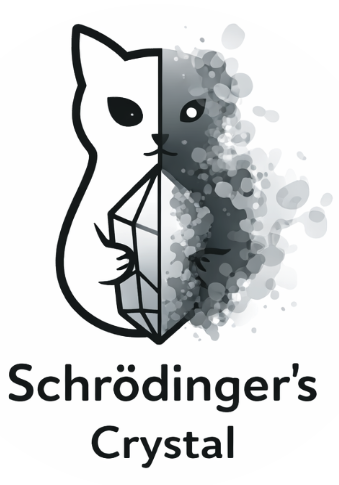
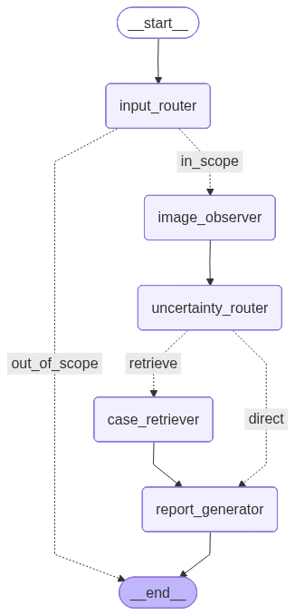

<p align="left">
	
</p>

#### A Proof-of-Concept Image Reasoning Agent for Protein Crystallization (powered by GPT-5.4)


## Demo
Try for yourself!
[Schrödinger's Crystals](https://huggingface.co/spaces/asphodel-thuang/image-reasoning-agent-ar26)


## 🤖 What This Agent Does
This is not just an image classifier.

Given a crystallization screening image, the agent:
- 🔍 Extracts visual features (e.g. edges, morphology, patterns)
- ⚖️ Estimates uncertainty (how confident or ambiguous the observation is)
- 🔁 Retrieves similar past cases when uncertainty is high
- 🧠 Performs case-based reasoning
- 📄 Outputs a **structured report with recommended next steps**

The goal is simple:  
**not just "what is this?" — but "what should I do next?"**


## 😼 Why "Schrödinger’s Crystal"?
In many crystallization experiments, an image is not clearly “crystal” or “not crystal”.

It can be:
- ambiguous  
- borderline  
- dependent on interpretation  

Like Schrödinger’s cat,  
the sample is **both crystal and not crystal — until we reason about it**.

This agent is designed to **resolve that uncertainty and make decisions**,  
not just predictions.


## 💠 Why Protein Crystals?
Proteins are the tiny machines that keep all living things running.  
Understanding their 3D structure is key to understanding function — and designing new medicines.

One powerful approach is **X-ray crystallography**, which requires growing protein crystals.  
But proteins don’t crystallize easily:

- thousands of experiments may be needed  
- outcomes are noisy and ambiguous  
- manual inspection is slow and subjective  

To address this, datasets like [MARCO](https://marco.ccr.buffalo.edu/about) were created to support automated analysis.

This project explores how **reasoning agents** can go beyond classification  
and assist decision-making in this process.


## 🔮 How Does It Work
### The Reasoning Graph
The agent is built as a reasoning graph using Langgraph.
                    
It first extracts features, then estimates uncertainty.
        
If uncertainty is low, it makes a direct decision.
        
If uncertainty is high, it retrieves similar cases and performs case-based reasoning before producing a recommendation.
<p align="left">
	
</p>

### Knowledge Base
Crystallization interpretation reference cases are extracted from this publically available handbook: [Crystal Growth 101](https://hamptonresearch.com/uploads/cg_pdf/CG101_COMPLETE_2019.pdf)


## How to Run

If you want to try the agent out, simply go to the demo link (at the top).

If you want to explore the repo further:

1. Prepare environment:
```bash
python3.10 -m venv venv
. venv/bin/activate
pip install -r requirements.txt
```
2. Create a `.env` file and add an active OpenAI API key to it.

3. Run `app.py` locally, or export key components in `src/mwm_vlm/components`
